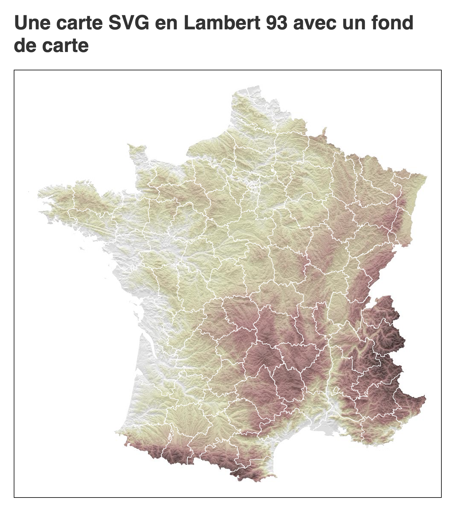

# Comment créer un fond de carte à partir de rasters d'altitude et un hillshade

Vous souhaitez faire une carte en javascript ou en python. Rien de plus facile aujourd'hui grâce à **d3.js**. Mais pourquoi pas la pimper un peu avec un fond de carte des reliefs ?

Python permet notamment d'industrialiser facilement ce type de processus.

> Ce tutoriel s'appuie en grande partie sur celui-ci d'[Adam Symington](https://pythonmaps.medium.com/?source=post_page-----efced5507aa3--------------------------------) : [Creating Beautiful Topography Maps with Python](https://towardsdatascience.com/creating-beautiful-topography-maps-with-python-efced5507aa3)

## Génération du fond de carte avec Python

Le notebook `prepare.ipynb` décrit comment télécharger les rasters puis les manipuler afin de générer un fond de carte.

## Rendu avec d3.js en SVG

Le code front est disponible dans le dossier `src`. Il s'appuie sur React mais on aurait pu utiliser un autre framework ou du vanilla js.

